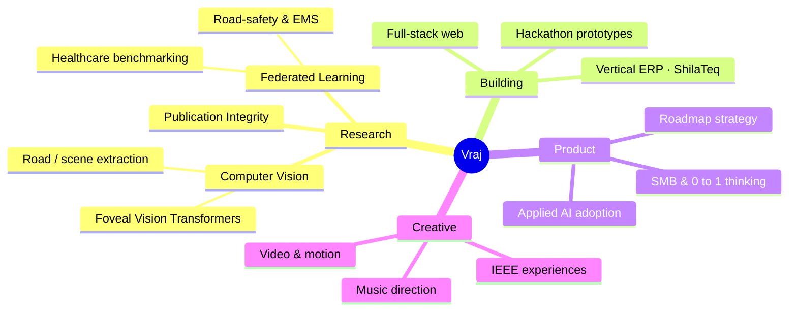

<!--
════════════════════════════════════════════════════════════════════════
  GalacticVraj — GitHub Profile README  ·  "aurora-gold" edition
  Drop this at:  github.com/GalacticVraj/GalacticVraj  →  README.md
  COMMIT ALSO:
    assets/header.svg            → animated header (flying comets)
    assets/footer.svg            → animated footer (aurora wave)
    .github/workflows/snake.yml  → generates the neon snake
  Palette:  teal #2dd4bf · gold #fbbf24 · emerald #34d399 · canvas #0a0f1e · text #c8f4e9
  ▸ SETUP + FIX for the analytics cards is at the very bottom of this file.
════════════════════════════════════════════════════════════════════════
-->

<!-- ░░░  ANIMATED HEADER  ░░░ -->
<a href="https://github.com/GalacticVraj">
  
</a>

<!-- ░░░  TYPING SUBTITLE  ░░░ -->
<div align="center">

[](https://git.io/typing-svg)

**[LinkedIn](https://www.linkedin.com/in/VrajTalati/)**  ·  **[YouTube](https://www.youtube.com/@VrajTalati)**  ·  **[Instagram](https://www.instagram.com/talati_vraj)**  ·  **[Email](mailto:vrajt.college@gmail.com)**


</div>

---

## whoami

```typescript
const vraj: Human = {
  education:  "B.Tech Computer Science × MBA (dual-degree) @ Nirma University — IT",
  leadership: "Technical Head, IEEE Student Branch NU",
  focus:      ["Computer Vision", "Federated Learning", "Applied ML", "Product"],
  builds:     ["full-stack apps", "vertical ERPs", "research prototypes", "hackathon wins"],
  alsoDoes:   ["music direction", "video & motion design", "teaching"],
  philosophy: "learn by consequence, not by lecture",
  status:     "always shipping something",
};
```

> I live where **research, product, and craft** overlap — training vision transformers one week,
> shipping a QR-based ERP for marble yards the next, and scoring a stage play in between.
> If it can be **built, benchmarked, or broken open to understand** — I'm in.

---

## how my work connects

<div align="center">



<sub><i>a live Mermaid mind-map — GitHub renders this natively, it's a real diagram, not an image.</i></sub>

</div>

---

## featured work

<table>
<tr>
<td width="50%" valign="top">

### GridGuard
**IEEE Metaverse Grand Challenge 2026** · Smart Cities
A zero-backend, browser-based grid-crisis simulator. Learners manage a city's power grid through a **Monte Carlo scenario engine**, a real-time **Learner Digital Twin**, and a **Gemini-powered Socratic AI advisor** — grasping energy trade-offs through consequence.
<br/><br/>
`React` · `TypeScript` · `Tailwind` · `Gemini API` · `Recharts`

[**→ Repository**](https://github.com/GalacticVraj/IEEEMETAVERSE)

</td>
<td width="50%" valign="top">

### ShilaTeq / StoneX
**Vertical ERP** · commercialization in progress
A QR-based operating system for small Indian marble & granite yards — inventory, slab tracking, and yard ops digitized for a trade that still runs on paper. Built end-to-end and taken toward go-to-market.
<br/><br/>
`Full-Stack` · `ERP` · `QR` · `SMB`

[**→ Product**](https://github.com/GalacticVraj)

</td>
</tr>
<tr>
<td width="50%" valign="top">

### FoViT — Foveal Vision Transformer
A PyTorch training pipeline for a **foveated ViT** on ImageNet-1k — attention that mimics how the human eye samples detail. Deep-work into efficient vision architectures.
<br/><br/>
`PyTorch` · `Vision Transformers` · `ImageNet`

[**→ Research**](https://github.com/GalacticVraj)

</td>
<td width="50%" valign="top">

### Federated Learning Research
Privacy-preserving ML on two fronts: a **healthcare benchmark on FLamby**, and a **road-safety / EMS framework** on India's NCRB & MoRTH data — training without ever pooling sensitive data.
<br/><br/>
`Federated Learning` · `Healthcare` · `Privacy`

[**→ Work**](https://github.com/GalacticVraj)

</td>
</tr>
</table>

<div align="center">
<br/>
<i>more in the arsenal —&nbsp; MethaneGuard (CV leak detection) &nbsp;·&nbsp; Truth-Anchor (vernacular fact-checking) &nbsp;·&nbsp; Predictive Maintenance (Azure IoT) &nbsp;·&nbsp; Publication Integrity (SPS) &nbsp;·&nbsp; Deep-Learning CNN / MNIST</i>
</div>

---

## tech stack

|  |  |
|---|---|
| **Languages** | Python · TypeScript · JavaScript · C++ · PHP · LaTeX |
| **ML & Data** | PyTorch · TensorFlow · Keras · scikit-learn · NumPy · Pandas · SciPy · Matplotlib |
| **Web & Build** | React · Vite · Tailwind CSS · Node.js |
| **Tools & Craft** | Git · Jupyter · Premiere Pro · Canva |

---

## github analytics

<div align="center">

<!-- Stats/top-langs/pins use github-stats-extended (maintained successor to
     github-readme-stats, drop-in compatible). If it ever rate-limits, you can
     self-host it — see SETUP > C at the bottom. -->


<!-- ★ contribution activity graph ★ -->


<!-- ★ NEON SNAKE — generated by .github/workflows/snake.yml, served from the "output" branch ★ -->


<!-- ★ 3D ISOMETRIC CONTRIBUTION GALAXY — generated by .github/workflows/3d-contrib.yml, served from the "3d" branch ★ -->


</div>

---

## pinned repositories

<div align="center">

<a href="https://github.com/GalacticVraj/IEEEMETAVERSE">
  
</a>
<a href="https://github.com/GalacticVraj/Deep-Learning-CNN-MNIST">
  
</a>
<a href="https://github.com/GalacticVraj/Breach_Pdeu">
  
</a>
<a href="https://github.com/GalacticVraj/3D-Portfolio">
  
</a>

</div>

---

<details>
<summary><b>beyond the code — click to expand</b></summary>
<br/>

- **Dual-degree** B.Tech Computer Science + MBA at Nirma University's Institute of Technology
- **Technical Head, IEEE Student Branch NU** — building cinematic web experiences, orientations & challenges
- **Builder of ShilaTeq / StoneX** — a vertical ERP taking marble & granite yards from paper to product
- **Music director** for the Hindi stage play *सत्ता / Satta* — with video & motion design on the side
- **Serial hackathon builder** — Bharatiya Antariksh, HackOut, SEMICON India, SIH, UNESCO Youth & more

</details>

<details>
<summary><b>research & selected work — click to expand</b></summary>
<br/>

| Area | Work |
|------|------|
| **Vision Transformers** | FoViT — foveated ViT training on ImageNet-1k |
| **Federated Learning** | Healthcare benchmarking on FLamby · Privacy-aware FL for road safety & EMS (NCRB/MoRTH) |
| **Applied CV** | MethaneGuard — methane-leak detection · road & scene extraction for urban mobility |
| **Trust & Integrity** | Multimodal scientific-publication integrity framework (SPS) · Truth-Anchor vernacular fact-checking |
| **Industrial ML** | Predictive maintenance on Azure IoT telemetry |

</details>

---

<div align="center">


<br/>

> _stay chaotic. ship anyway._

</div>

<!-- ░░░  ANIMATED FOOTER  ░░░ -->


<!--
════════════════════════════════════════════════════════════════════════
  SETUP
  ────────────────────────────────────────────────────────────────────
  A) FILES TO COMMIT to github.com/GalacticVraj/GalacticVraj
       README.md
       assets/header.svg
       assets/footer.svg
       .github/workflows/snake.yml
       .github/workflows/3d-contrib.yml
     If your default branch is "master" not "main": in the header & footer
      URLs change /main/ → /master/.

  B) NEON SNAKE (the moving snake that eats your graph)
       1. Commit .github/workflows/snake.yml (already included).
       2. Repo → Settings → Actions → General → Workflow permissions →
          "Read and write permissions" → Save.
       3. Repo → Actions tab → "generate snake" → Run workflow.
       4. It creates an "output" branch with snake-neon.svg — the README
          already points there. Re-runs itself every 12h.

  C) ANALYTICS CARDS (stats / top-langs / pins)
     These now use github-stats-extended.vercel.app — the maintained,
     drop-in successor to github-readme-stats (same params, same colors),
     which is far more reliable than the old shared instance.
     If it ever rate-limits too, self-host it (free):
       1. Follow  github-stats-extended.vercel.app/frontend/docs/deploy
          (Deploy to Vercel; add a GitHub token env var; redeploy).
       2. Replace every  github-stats-extended.vercel.app  in this README
          with  your-name.vercel.app  (the 2 stat cards + 4 pin cards).

  D) 3D ISOMETRIC CONTRIBUTION GALAXY (the second animated graph)
       1. Commit .github/workflows/3d-contrib.yml (already included).
       2. Same "Read and write permissions" from step B covers it.
       3. Repo → Actions tab → "generate 3d contrib" → Run workflow.
       4. It builds an animated isometric SVG of your whole contribution
          history and pushes it to a "3d" branch — the README already
          points there. Re-runs itself daily.
       (Want a different look? The action also outputs profile-night-view,
        profile-season-animate, profile-gitblock, etc. — swap the filename
        in the README .)

  MORE (just ask): WakaTime coding-time stats, a rotating planet in the
  header, or denser comet showers.
════════════════════════════════════════════════════════════════════════
-->
