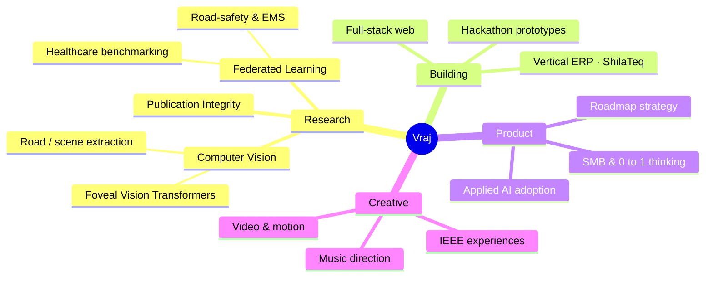

<!--
════════════════════════════════════════════════════════════════════════
  GalacticVraj — GitHub Profile README  ·  synthwave / galactic edition
  Drop this at:  github.com/GalacticVraj/GalacticVraj  →  README.md
  Palette (threaded through every card):
    hot-pink #f72585 · magenta #b5179e · violet #7209b7 · aqua #4cc9f0
    canvas #1a0b2e · text #e0dfff
  Search "TODO" at the bottom for 3 optional finishing touches.
════════════════════════════════════════════════════════════════════════
-->

<!-- ░░░░░░░░░░░░░  HEADER  ░░░░░░░░░░░░░ -->
<a href="https://github.com/GalacticVraj">
  
</a>

<!-- ░░░░░░░░░░░░░  TYPING SUBTITLE + BADGES  ░░░░░░░░░░░░░ -->
<div align="center">

[](https://git.io/typing-svg)

<a href="https://www.linkedin.com/in/VrajTalati/"></a>
<a href="https://www.youtube.com/@VrajTalati"></a>
<a href="https://www.instagram.com/talati_vraj"></a>
<a href="mailto:vrajt.college@gmail.com"></a>
<br/>

<a href="https://github.com/GalacticVraj?tab=followers"></a>


</div>

---

## ✦ &nbsp;whoami

```typescript
const vraj: Human = {
  education:  "B.Tech Computer Science × MBA (dual-degree) @ Nirma University — IT",
  leadership: "Technical Head, IEEE Student Branch NU",
  focus:      ["Computer Vision", "Federated Learning", "Applied ML", "Product"],
  builds:     ["full-stack apps", "vertical ERPs", "research prototypes", "hackathon wins"],
  alsoDoes:   ["music direction 🎼", "video & motion design 🎬", "teaching"],
  philosophy: "learn by consequence, not by lecture",
  status:     "always shipping something 🚀",
};
```

> I live where **research, product, and craft** overlap — training vision transformers one week,
> shipping a QR-based ERP for marble yards the next, and scoring a stage play in between.
> If it can be **built, benchmarked, or broken open to understand** — I'm in.

---

## ✦ &nbsp;how my work connects

<div align="center">



<sub><i>↑ live Mermaid mind-map — GitHub renders this natively, it's a real diagram, not an image.</i></sub>

</div>

---

## ✦ &nbsp;featured work

<table>
<tr>
<td width="50%" valign="top">

### ⚡ GridGuard
**IEEE Metaverse Grand Challenge 2026** · Smart Cities
A zero-backend, browser-based grid-crisis simulator. Learners manage a city's power grid through a **Monte Carlo scenario engine**, a real-time **Learner Digital Twin**, and a **Gemini-powered Socratic AI advisor** — grasping energy trade-offs through consequence.
<br/><br/>
`React` `TypeScript` `Tailwind` `Gemini API` `Recharts`

[**→ Repository**](https://github.com/GalacticVraj/IEEEMETAVERSE)

</td>
<td width="50%" valign="top">

### 🏭 ShilaTeq / StoneX
**Vertical ERP** · commercialization in progress
A QR-based operating system for small Indian marble & granite yards — inventory, slab tracking, and yard ops digitized for a trade that still runs on paper. Built end-to-end and taken toward go-to-market.
<br/><br/>
`Full-Stack` `ERP` `QR` `SMB`

[**→ Product**](https://github.com/GalacticVraj)

</td>
</tr>
<tr>
<td width="50%" valign="top">

### 🔬 FoViT — Foveal Vision Transformer
A PyTorch training pipeline for a **foveated ViT** on ImageNet-1k — attention that mimics how the human eye samples detail. Deep-work into efficient vision architectures.
<br/><br/>
`PyTorch` `Vision Transformers` `ImageNet`

[**→ Research**](https://github.com/GalacticVraj)

</td>
<td width="50%" valign="top">

### 🩺 Federated Learning Research
Privacy-preserving ML on two fronts: a **healthcare benchmark on FLamby**, and a **road-safety / EMS framework** on India's NCRB & MoRTH data — training without ever pooling sensitive data.
<br/><br/>
`Federated Learning` `Healthcare` `Privacy`

[**→ Work**](https://github.com/GalacticVraj)

</td>
</tr>
</table>

<div align="center">
<br/>
<sub><b>more in the arsenal</b></sub><br/>


</div>

---

## ✦ &nbsp;tech stack

<div align="center">

**languages**
<br/>


**machine learning & data**
<br/>


**web & build**
<br/>


**tools & craft**
<br/>


</div>

---

## ✦ &nbsp;github analytics

<div align="center">


<!-- ★ the contribution activity graph — the standout ★ -->


</div>

---

## ✦ &nbsp;pinned repositories

<div align="center">

<a href="https://github.com/GalacticVraj/IEEEMETAVERSE">
  
</a>
<a href="https://github.com/GalacticVraj/Deep-Learning-CNN-MNIST">
  
</a>
<a href="https://github.com/GalacticVraj/Breach_Pdeu">
  
</a>
<a href="https://github.com/GalacticVraj/3D-Portfolio">
  
</a>

</div>

---

<details>
<summary><b>✦ &nbsp;beyond the code — click to expand</b></summary>
<br/>

- 🎓 **Dual-degree** B.Tech Computer Science + MBA at Nirma University's Institute of Technology
- ⚙️ **Technical Head, IEEE Student Branch NU** — building cinematic web experiences, orientations & challenges
- 🏭 **Builder of ShilaTeq / StoneX** — a vertical ERP taking marble & granite yards from paper to product
- 🎼 **Music director** for the Hindi stage play *सत्ता / Satta* — with video & motion design on the side
- 🥇 **Serial hackathon builder** — Bharatiya Antariksh, HackOut, SEMICON India, SIH, UNESCO Youth & more

</details>

<details>
<summary><b>✦ &nbsp;research & selected work — click to expand</b></summary>
<br/>

| Area | Work |
|------|------|
| **Vision Transformers** | FoViT — foveated ViT training on ImageNet-1k |
| **Federated Learning** | Healthcare benchmarking on FLamby · Privacy-aware FL for road safety & EMS (NCRB/MoRTH) |
| **Applied CV** | MethaneGuard — methane-leak detection · road & scene extraction for urban mobility |
| **Trust & Integrity** | Multimodal scientific-publication integrity framework (SPS) · Truth-Anchor vernacular fact-checking |
| **Industrial ML** | Predictive maintenance on Azure IoT telemetry |

</details>

---

<!-- ░░░░░░░░░░░░░  QUOTE + FOOTER  ░░░░░░░░░░░░░ -->
<div align="center">


<br/>

> _"stay chaotic. ship anyway."_


</div>

<!--
════════════════════════════════════════════════════════════════════════
  TODO — 3 optional finishing touches (each ~2 min):

  1. SNAKE ANIMATION (eats your contribution graph):
     Add .github/workflows/snake.yml (Platane/snk action) in THIS repo,
     then paste this where you want it:
       

  2. SPOTIFY "now playing" or WAKATIME coding stats — say the word,
     I'll wire the exact badge/action.

  3. Swap the placeholder links (→ Product / → Research / → Work) for real
     repo URLs once those repos are public. The 4 pinned cards already
     pull LIVE data automatically.
════════════════════════════════════════════════════════════════════════
-->
