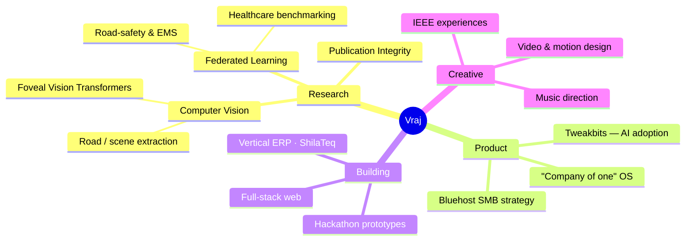

<!--
════════════════════════════════════════════════════════════════════════
  GalacticVraj — GitHub Profile README
  Drop this file at:  github.com/GalacticVraj/GalacticVraj  →  README.md
  Theme palette (kept consistent across every card):
    violet  #a855f7   cyan #22d3ee   bg #0d1117   text #c9d1d9   border #30363d
  Search "TODO" for the 3 optional things to finish (see bottom of file).
════════════════════════════════════════════════════════════════════════
-->

<!-- ░░░░░░░░░░░░░░░  HEADER BANNER  ░░░░░░░░░░░░░░░ -->
<a href="https://github.com/GalacticVraj">
  
</a>

<!-- ░░░░░░░░░░░░░░░  TYPING SUBTITLE  ░░░░░░░░░░░░░░░ -->
<div align="center">

[](https://git.io/typing-svg)

<!-- ░░░ SOCIAL / STATUS BADGES ░░░ -->
<a href="https://www.linkedin.com/in/VrajTalati/"></a>
<a href="https://www.youtube.com/@VrajTalati"></a>
<a href="https://www.instagram.com/talati_vraj"></a>
<a href="mailto:vrajt.college@gmail.com"></a>
<br/>

<a href="https://github.com/GalacticVraj?tab=followers"></a>


</div>

---

##  &nbsp;About Me

```typescript
const vraj: Human = {
  role:       ["Product Strategist @ Bluehost", "Founder @ Tweakbits", "Researcher"],
  education:  "B.Tech CS × MBA (dual-degree) @ Nirma University — Institute of Technology",
  leadership: "Technical Head, IEEE Student Branch NU · Architecture Guild lead @ Bluehost",
  focus:      ["Computer Vision", "Federated Learning", "Applied ML", "Product Strategy"],
  builds:     ["full-stack apps", "vertical ERPs", "research prototypes", "hackathon wins"],
  alsoDoes:   ["music direction 🎼", "video & motion 🎬", "teaching"],
  currentBet: "AI that actually ships for the company-of-one — small businesses, real leverage",
  philosophy: "learn by consequence, not by lecture",
};
```

> I live at the intersection of **research, product, and craft** — training vision transformers one week,
> shipping a QR-based ERP for marble yards the next, and scoring a stage play in between. If it can be
> **built, benchmarked, or broken open to understand** — I'm in.

---

## 🧠 &nbsp;How My Work Connects

<div align="center">



<sub><i>GitHub renders this Mermaid mind-map natively — it's a live diagram, not an image.</i></sub>

</div>

---

## 🚀 &nbsp;Featured Work

<table>
<tr>
<td width="50%" valign="top">

### ⚡ GridGuard
**IEEE Metaverse Grand Challenge 2026** · Smart Cities
A zero-backend, browser-based grid-crisis simulator. Learners manage a city's power grid through a **Monte Carlo scenario engine**, a real-time **Learner Digital Twin**, and a **Gemini-powered Socratic AI advisor** — grasping energy trade-offs through consequence.
<br/><br/>
`React` `TypeScript` `Tailwind` `Gemini API` `Recharts`

[**→ Repository**](https://github.com/GalacticVraj/IEEEMETAVERSE)

</td>
<td width="50%" valign="top">

### 🏭 ShilaTeq / StoneX
**Vertical ERP** · commercialization in progress
A QR-based operating system for small Indian marble & granite yards — inventory, slab tracking, and yard ops digitized for a trade that still runs on paper. Built end-to-end and taken toward go-to-market.
<br/><br/>
`Full-Stack` `ERP` `QR` `SMB`

[**→ Product**](https://github.com/GalacticVraj)

</td>
</tr>
<tr>
<td width="50%" valign="top">

### 🔬 FoViT — Foveal Vision Transformer
A PyTorch training pipeline for a **foveated ViT** on ImageNet-1k — attention that mimics how the human eye samples detail. Deep-work into efficient vision architectures.
<br/><br/>
`PyTorch` `Vision Transformers` `ImageNet`

[**→ Research**](https://github.com/GalacticVraj)

</td>
<td width="50%" valign="top">

### 🩺 Federated Learning Research
Privacy-preserving ML across two fronts: a **healthcare benchmark on FLamby**, and a **road-safety / EMS framework** on India's NCRB & MoRTH data — training without pooling sensitive data.
<br/><br/>
`Federated Learning` `Healthcare` `Privacy`

[**→ Work**](https://github.com/GalacticVraj)

</td>
</tr>
</table>

<div align="center">
<br/>
<sub><b>More in the arsenal:</b></sub><br/>


</div>

---

## 🛠️ &nbsp;Tech Stack

<div align="center">

**Languages**
<br/>


**Machine Learning & Data**
<br/>


**Web & Build**
<br/>


**Tools & Craft**
<br/>


</div>

---

## 📊 &nbsp;GitHub Analytics

<div align="center">


<!-- Contribution activity graph -->


<!-- Trophies -->


</div>

---

## 📌 &nbsp;Pinned Repositories

<div align="center">

<a href="https://github.com/GalacticVraj/IEEEMETAVERSE">
  
</a>
<a href="https://github.com/GalacticVraj/Deep-Learning-CNN-MNIST">
  
</a>
<a href="https://github.com/GalacticVraj/Breach_Pdeu">
  
</a>
<a href="https://github.com/GalacticVraj/3D-Portfolio">
  
</a>

</div>

---

<details>
<summary><b>🏆 &nbsp;Beyond the Code — click to expand</b></summary>
<br/>

- 🎓 **Dual-degree** B.Tech Computer Science + MBA at Nirma University's Institute of Technology
- 🧑‍💼 **Product Strategy @ Bluehost** — shaping the SMB roadmap toward an *"operating system for the company of one"*
- 🚀 **Founder, Tweakbits Technologies Pvt. Ltd.** — an AI-adoption agency helping teams put AI to work
- ⚙️ **Technical Head, IEEE Student Branch NU** — building cinematic web experiences, orientations & challenges
- 🏗️ **Architecture Guild lead @ Bluehost** — driving engineering coherence across teams
- 🎼 **Music director** for the Hindi stage play *सत्ता / Satta* — and video / motion design on the side
- 🥇 **Serial hackathon builder** — Bharatiya Antariksh, HackOut, SEMICON India, SIH, UNESCO Youth & more

</details>

<details>
<summary><b>📚 &nbsp;Research & Selected Work — click to expand</b></summary>
<br/>

| Area | Work |
|------|------|
| **Vision Transformers** | FoViT — foveated ViT training on ImageNet-1k |
| **Federated Learning** | Healthcare benchmarking on FLamby · Privacy-aware FL for road safety & EMS (NCRB/MoRTH) |
| **Applied CV** | MethaneGuard — methane-leak detection · road & scene extraction for urban mobility |
| **Trust & Integrity** | Multimodal scientific-publication integrity framework (SPS) · Truth-Anchor vernacular fact-checking |
| **Industrial ML** | Predictive maintenance on Azure IoT telemetry |

</details>

---

<!-- ░░░░░░░░░░░░░░░  QUOTE + FOOTER  ░░░░░░░░░░░░░░░ -->
<div align="center">


<br/>

> _"Stay chaotic. Ship anyway."_


</div>

<!--
════════════════════════════════════════════════════════════════════════
  TODO — 3 optional finishing touches (each ~2 min):

  1. SNAKE ANIMATION (eats your contribution graph):
     Create .github/workflows/snake.yml in this SAME repo with the
     Platane/snk action, then add this image where you want it:
       

  2. SPOTIFY "now playing" or WAKATIME coding stats — say the word and
     I'll wire up the exact badge/action.

  3. Replace the placeholder repo links (marked → Product / → Research /
     → Work above) with the real public repo URLs once those repos are
     public. The 4 pinned cards already pull LIVE data automatically.
════════════════════════════════════════════════════════════════════════
-->
